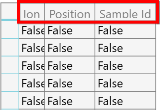

# How to Change the Font Size for Header With ColumnSizer as SizeToHeader in WPF DataGrid?

This sample show cases how to change the fontsize for header with ColumnSizer as SizeToHeader in [WPF DataGrid](https://www.syncfusion.com/wpf-controls/datagrid) (SfDataGrid).

The header text width is calculated with static font size in `DataGrid` and you can change the header font size using [HeaderStyle](https://help.syncfusion.com/cr/wpf/Syncfusion.UI.Xaml.Grid.SfDataGrid.html#Syncfusion_UI_Xaml_Grid_SfDataGrid_HeaderStyle) property. You can achieve this by overriding GetFormattedText method in [SfDataGrid.ColumnSizer](https://help.syncfusion.com/cr/wpf/Syncfusion.UI.Xaml.Grid.SfDataGrid.html#Syncfusion_UI_Xaml_Grid_SfDataGrid_ColumnSizer) class.

#### C#
``` c#
public class GridColumnSizerExt : GridColumnSizer
{
    public GridColumnSizerExt(SfDataGrid dataGrid) : base(dataGrid)
    {

    }

    protected override FormattedText GetFormattedText(GridColumn column, object record, string displayText)
    {
        var formattedText = base.GetFormattedText(column, record, displayText);

        if (record == null)
        {
            formattedText.SetFontSize(16);
        }
        return formattedText;
    }
}
```



## Requirements to run the demo
 Visual Studio 2015 and above versions